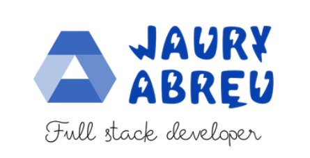

# ChatBot
## Installation & Setup

[Install Python] https://phoenixnap.com/kb/how-to-install-python-3-windows
[Install pip] https://phoenixnap.com/kb/install-pip-windows

If you've got Python and pip installed, you can verify their version by running the following commands in your terminal or command line tools.

```
python3 --version
```
```
pip --version
```

## Installing Flask

Please execute the requirements.txt file using the following pip command in your terminal.

```
pip install -r requirements.txt
```


## Launching the ChatBot Application via the Terminal

```
cd Move to the directory of your choice
```

```
python app.py
```


## What you will create

This Python code sets up a Flask web application that serves as a simple chat interface utilizing the LangChain library. The chat system is designed to respond to user inputs based on a predefined prompt, which includes a context and a question. The responses are generated by a chain of components, including a document retriever, a prompt template, a language model, and an output parser.

# ChatBot Link
The Chatbot is constructed using the LangChain/ChatGPT Data model.

```
https://python.langchain.com/docs/expression_language/how_to/map
```

# User-Html

```
var userHtml = '<div class="d-flex justify-content-end mb-4"><div class="msg_cotainer_send">' + user_input + '<span class="msg_time_send">'+ time + 
    '</span></div><div class="img_cont_msg"></div></div>';
```

# Bot-HTML

```
var botHtml = '<div class="d-flex justify-content-start mb-4"><div class="img_cont_msg"></div><div class="msg_cotainer">' + bot_response + '<span class="msg_time">' + time + '</span></div></div>';
```